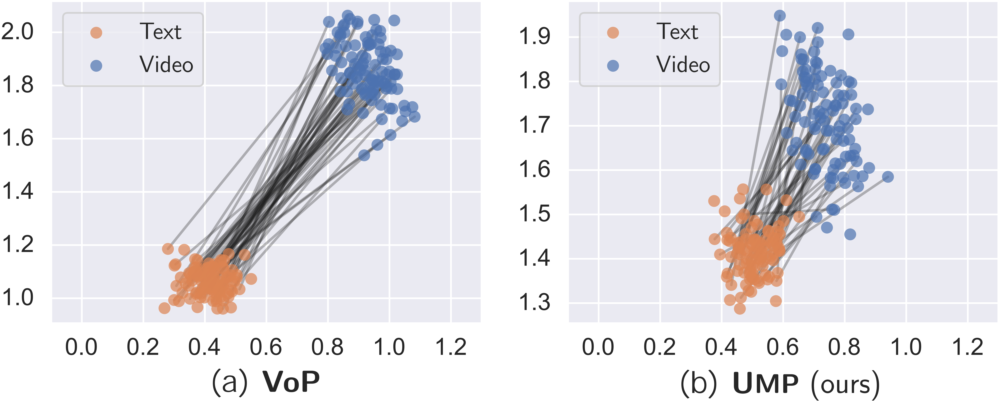

# <i>UMP:</i> Unified Modality-aware Prompt Tuning for Text-Video Retrieval
[Haonan Zhang](https://zchoi.github.io/), [Pengpeng Zeng](https://ppengzeng.github.io/), [Lianli Gao](https://lianligao.github.io/), [Jingkuan Song](https://cfm.uestc.edu.cn/~songjingkuan/), [Heng Tao Shen](https://cfm.uestc.edu.cn/~shenht/)

[`arXiv`](https://arxiv.org/abs/2310.08446) | [`BibTeX`](#bibliography)

This is an official PyTorch implementation of the paper **UMP: Unified Modality-aware Prompt Tuning for Text-Video Retrieval** (under review). In this work, we

- present UMP, a simple yet effective method that extends prompt tuning with pre-trained models for fast adaptation to text-video retrieval.
- devise a lightweight UPG module that generates modality-aware prompt tokens to facilitate the learning of a well-aligned unified representation.
- introduce a parameter-free STS module that fully exploits the spatial-temporal information among video tokens and prompt tokens

## Modality Gap issue

<b>Unified Representation Alignment</b>: existing methods adopt isolated text and video prompt tokens to prompt text and video encoders separately (<i>e.g.</i>, VoP) making it challenging for models to learn a well-aligned unified representation, <i>i.e.</i>, modality gap. 
<p align="center">

</p>

<p align="center"><b>Fig. 1.</b> Visualization comparison of modality gap between (a) VoP and (b) UMP via UMAP. Paired text-video inputs are fed into text and video encoders separately and the embeddings from the last layers are visualized via UMAP.</p>

## Overview

Prompt tuning, an emerging parameter-efficient strategy, leverages the powerful knowledge of large-scale pre-trained image-text models (<i>e.g.</i>, CLIP) to swiftly adapt to downstream tasks. Despite its effectiveness, adapting prompt tuning to text-video retrieval encounters two limitations: i) existing methods adopt two isolated prompt tokens to prompt two modal branches separately, making it challenging to learn a well-aligned unified representation, <i>i.e.</i>, modality gap; ii) video encoders typically utilize a fixed pre-trained visual backbone, neglecting the incorporation of spatial-temporal information.

<p align="center">

</p>

<p align="center"><b>Fig. 2.</b> Performance comparison of parameter-efficient methods (including our UMP) and full fine-tuning (FULL). The diameter of the bubble is proportional to the number of trainable parameters.</p>

To this end, we propose a simple yet effective method, named Unified Modality-aware Prompt Tuning (UMP), for text-video retrieval. Concretely, we first introduce a Unified Prompt Generation (UPG) module to dynamically produce modality-aware prompt tokens, enabling the perception of prior semantic information on both video and text inputs. These prompt tokens are simultaneously injected into two branches that can bridge the semantics gap between two modalities in a unified-adjusting manner. Then, we design a parameter-free Spatial-Temporal Shift (STS) module to facilitate both intra- and inter-communication among video tokens and prompt tokens in the spatial-temporal dimension. Notably, extensive experiments on four widely used benchmarks show that UMP achieves new state-of-the-art performance compared to existing prompt-tuning methods without bringing excessive parameters.


## Usage
### Requirements
The UMP framework depends on the following main requirements:
- torch==1.8.1+cu114
- Transformers 4.6.1
- OpenCV 4.5.3
- tqdm
  
### How to Run (take *MSR-VTT* for example)
You need to download the corresponding data file from the [`OneDrieve Drive link`]() provided and point out the data path ```--videos_dir``` when training. Then, you will need to run [`run_msrvtt.sh`](https://github.com/zchoi/UMP_TVR/blob/main/run_msrvtt.sh) to train the model.

For simple training on MSR-VTT-9k with default hyperparameters:
```
bash run_msrvtt.sh
```

> [!NOTE]
> We are continuously refactoring our code, be patient and wait for updates!

## Bibliography
If you find this repository helpful for your project, please consider citing our work:

```
@article{zhang2024ump,
  title={UMP: Unified Modality-aware Prompt Tuning for Text-Video Retrieval},
  author={Haonan Zhang, Pengpeng Zeng, Lianli Gao, Jingkuan Song, Heng Tao Shen},
  journal={arXiv preprint arXiv:XXX.XXX},
  year={2024}
}
```
